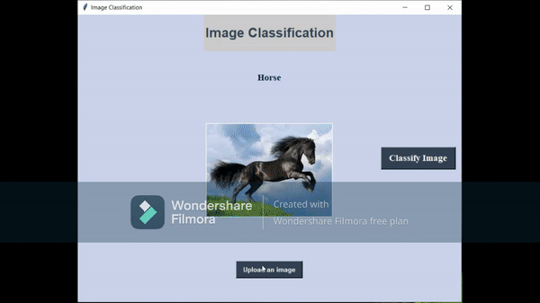

# Image_Detection


In this project, Images are classified using Graphical User Interface (GUI) from the given dataset using deep learning with keras. The accuracy for the dataset was found using train test split. The accuracy came about 60%. Images are uploaded as shown in the Gif below. Some of the images were detected accurately while the rest are not classified correctly. 
 
- OpenCV

 ```bash
  pip install opencv-python
 ```
- Pillow
 ```bash
  pip install PIL
 ```
- Numpy
 ```bash
   pip install numpy
  ```

- keras
 ```
 from tensorflow import keras
 ````
 
 - Tkinter
 ```
 import Tkinter as tk
 ````
### Steps involved:

i. First, the dataset 'cifar10' is imported from the keras dataset.

ii. It is then initialized to test train data along with labels.

iii. Image Preprocessing is done to convert the images into float and displayed in order to ensure that the data that is being trained is correct or not.

iv. Imported necessary modules from the keras library for the project

````
from keras.models import Sequential
from keras.layers import Dense
from keras.layers import Dropout
from keras.layers import Flatten
from keras.constraints import maxnorm
from keras.optimizers import adam_v2
from keras.layers.convolutional import Conv2D
from keras.layers.convolutional import MaxPooling2D
from keras.utils import np_utils
````

v. One hot encoding is performed on the target class. It is done to get a better prediction. The categorical values are first mapped to integer values and then each integer value is represented as a binary vector.


vi. A neural network is defined to train the dataset containing images.
  a. The input layer to the network is of size 32*32
  
  b. Different types of hidden layers like Conv2D, MaxPooling, Dense, Dropout layers are used with different size of neurons. 
  
  c. The activation functions used are relu and Softmax
  
vii. Now the model is compiled with adam optimizer and the accuracy and losses are calculated.

v. The summary of the model evaluted is given below:

 ```
 Model: "sequential"
_________________________________________________________________
Layer (type)                 Output Shape              Param #   
=================================================================
conv2d (Conv2D)              (None, 32, 32, 32)        896       
_________________________________________________________________
dropout (Dropout)            (None, 32, 32, 32)        0         
_________________________________________________________________
conv2d_1 (Conv2D)            (None, 32, 32, 32)        9248      
_________________________________________________________________
max_pooling2d (MaxPooling2D) (None, 16, 16, 32)        0         
_________________________________________________________________
flatten (Flatten)            (None, 8192)              0         
_________________________________________________________________
dense (Dense)                (None, 512)               4194816   
_________________________________________________________________
dropout_1 (Dropout)          (None, 512)               0         
_________________________________________________________________
dense_1 (Dense)              (None, 10)                5130      
=================================================================
Total params: 4,210,090
Trainable params: 4,210,090
Non-trainable params: 0
__________________________
```

vi. Accuracy and losses are calculated by training the model with 10 epoch (1 epoch is one set of Forward and Backward propagation) and batch size of 32.

vii. Now, the list of classes in the dataset are defined in a dictionary and predictions are made with the help of sample image. An image is given as input and is checked whether it belongs to the given class in the dictionary. The image is viewed correctly along with the class number.

 .png)

viii. Graphical User Interface is now implemented to view and classify the image. The data is loaded from the model file 
```
myfirst_cifarmodel.h5
```
ix. Two buttons 'Upload an Image' and 'Classify Image' are definded with functions for performing the desired operations.

x. The output is displayed from the below gif:



### Note: 

Due to some problem with the repository in Github, this file cannot be viewed directly. So I have created a link below to access the code:

Link- [Image_Detection.ipynb](https://nbviewer.jupyter.org/github/Saketh1196/Image_Classification/blob/main/Image_Detection.ipynb)


