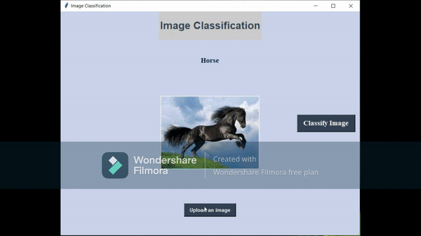

# Image_Detection


In this project, Images are classified using Graphical User Interface (GUI) from the given dataset. 

- OpenCV

 ```bash
  pip install opencv-python
 ```
- Pillow
 ```bash
  pip install PIL
 ```
- Numpy
 ```bash
   pip install numpy
  ```

- keras
 ```
 from tensorflow import keras
 ````
### Steps involved:

i. The names of the data in the dataset are classified into 9 different groups and are defined in a list.

ii. Image Preprocessing is done to convert the images into grey scale and displayed in order to ensure that the data that is being trained is correct or not.

iii. A neural network is defined to train the dataset containing images.
  1. The input layer for the network is of the shape 28*28.
  
  2. One hidden layer of size 128 neurons are used along with the activation function 'Relu'. If the computed value is negative then the result would be 0 and if the computed value is positive then the output value is 1.
  
  3. The output layer is defined with a size of 10 neurons.
  
iv. Now the model is compiled with adam optimizer and the accuracy and  losses are calculated.

v. Accuracy and losses are calculated by training the model with epoch (1 epoch is one set of Forward and Backward propagation).

vi. Predictions are now made on the image. When running the prediction it is observed that it returns the class name as a number for the output

vii. Two functions are defined to display the image and the corresponding bar graph indicating to the class to which the image belongs and how accurate the image is with the above trained and test accuracy.


### Note: 

Due to some problem with the repository in Github, this file cannot be viewed directly. So I have created a link below to access the code:

[Image_Classification.ipynb](https://nbviewer.jupyter.org/github/Saketh1196/Image_Classification/blob/main/Image_Classification.ipynb)


